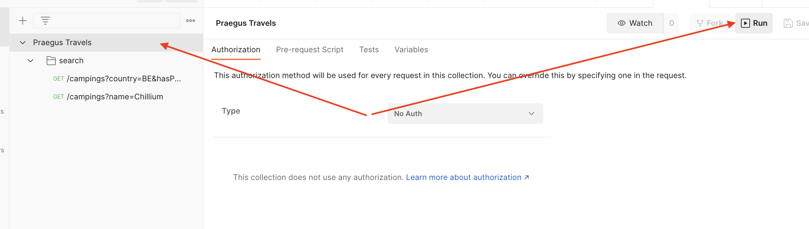

#  Integratietesten met Postman

Integratietesten zijn van cruciaal belang om ervoor te zorgen dat verschillende componenten van je applicatie correct met elkaar communiceren.

Met Postman kun je eenvoudig HTTP-verzoeken sturen en de respons controleren, waardoor het een ideale tool is voor het uitvoeren van integratietesten. In deze training zullen we stap voor stap door het proces gaan van het maken van testcases, het uitvoeren van tests en het rapporteren van de resultaten. Aan het einde van deze training heb je de kennis en vaardigheden om effectieve integratietesten uit te voeren met Postman.

## Wat heb je nodig

- [Praegus Travels](https://bestanden.maatos.nl/2020/10/a32a9be0-praegustravels.zip)
- [Postman](https://www.postman.com/downloads/)

## Opdrachten

### Start Praegus Travels

1. Download de Praegus Travels zip en pak deze uit.
2. Start de applicatie met het bestand `startTravels.command` (Mac) of `startTravels.bat` (Windows)
3. Ga in je browser naar http://localhost:8123/ en controleer of je applicatie draait.

### Postman

1. Installeer Postman op je machine.
2. Download de `Praegus Travels.postman_collection.json` in deze repository
3. Open Postman en ga in het menu naar File > Import
4. Selecteer hier de `Praegus Travels.postman_collection.json` en importeer deze in Postman.
5. Klik aan de linkerkant op het Pragus Travels mapje en run de test.
6. Analyseer de uitkomsten en bekijk waarom de testen falen.

### Authenticatie

Om de API van Praegus Travels te kunnen benaderen hebben we authenticatie nodig. Deze gaan we nu toevoegen.

1. Open de developer tools van je browser en ga naar Praegus Travels
2. Zoek in de requesten binnen de netwerk tab naar een gebruikersnaam en wachtwoord
3. Ga weer op het mapje Praegus Travels staan en selecteer Authorization.
4. Selecteer bij type "Basic Authentication"
5. Geef de gebruikersnaam en wachtwoord op en draai de testen opnieuw.

### Nieuwe camping toevoegen

1. Bekijk goed de bestaande tests van ieder request (Tabje tests) en voeg zelf wat extra testen toe.
2. Open je developer tools en ga weer naar de Praegus Travels applicatie
3. Voeg een nieuwe camping toe.
4. Zoek in je developer tools naar het POST request van het aanmaken.
5. Klik rechtermuisknop en kopieer deze als CURL
6. Ga naar Postman in het menu naar File > Import en plak vervolgens onder Raw text het request
7. Importeer het request in je collectie
8. Voeg extra testen toe en verifieer of je nieuwe camping ook echt daadwerkelijk toegevoegd is

### BONUS Postman CLI

1. Probeer je Praegus Travels testen te draaien vanaf de CLI
2. Gebruik hiervoor de NPM package [Newman](https://www.npmjs.com/package/newman)
