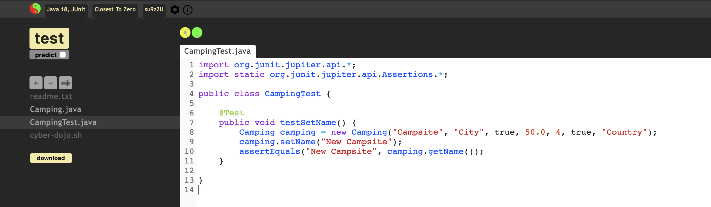

#  Unittesten

Het uitvoeren van unittesten is van essentieel belang in de wereld van softwareontwikkeling. Hier zijn enkele redenen waarom het unittesten van code cruciaal is:

Vroegtijdige foutdetectie: Unittesten stellen ontwikkelaars in staat om fouten in hun code vroegtijdig op te sporen. Door individuele eenheden van code te testen, kunnen potentiële bugs en onverwacht gedrag worden geïdentificeerd voordat de code wordt geïntegreerd met andere delen van het systeem. Dit helpt om kostbare fouten in latere stadia van de ontwikkeling te voorkomen.
Verbeterde codekwaliteit: Unittesten dwingen ontwikkelaars om goed gestructureerde en modulaire code te schrijven. Het testen van afzonderlijke eenheden bevordert een beter begrip van de codebase en stimuleert het schrijven van herbruikbare en onderhoudbare code. Dit leidt tot een verbeterde codekwaliteit en maakt het gemakkelijker om wijzigingen aan te brengen en nieuwe functionaliteit toe te voegen.
Regressietesten: Wanneer er wijzigingen worden aangebracht in de code, zorgen unittesten ervoor dat bestaande functionaliteit behouden blijft. Door de unittesten opnieuw uit te voeren, kan worden gecontroleerd of de wijzigingen geen onbedoelde bijwerkingen hebben gehad op andere delen van de code. Dit minimaliseert het risico op regressiefouten en zorgt voor een stabielere software.
Vertrouwen opbouwen: Unittesten bieden een vangnet voor ontwikkelaars. Het geeft hen vertrouwen in hun code, wetende dat deze correct werkt volgens de verwachtingen. Dit vertrouwen is essentieel bij het onderhouden en doorontwikkelen van software, en het bevordert ook samenwerking binnen het ontwikkelteam.

## Wat heb je nodig

1. Ga naar [Cyber Dojo](https://cyber-dojo.org/creator/choose_type?exercise_name=Closest%20To%20Zero&language_name=Java%2018%2C%20JUnit)
2. Kies voor Solo en klik daarna op OK
3. Hernoem nu de bestanden in dit project:

   Hiker.java > Camping.java

   HikerTest.java > CampingTest.java

4. In deze repository staan deze files ook, plak de inhoud hiervan in je Cyber Dojo omgeving en run de testen.

## Opdrachten

Onze camping class bevat nog geen enkele logica, in deze opdrachten gaan we wat uitbreidingen doen en schrijven we hiervoor unittesten.

### Sterren

Er is een maximum van 5 sterren die je kunt toewijzen aan een camping. Implementeer dit in de Camping class en schrijf enkele unittesten om dit aan te tonen. Denk aan grenswaarden en equivalentieklassen.

### Voorzieningen

Aan een camping willen we bijhouden welke extra voorzieningen er allemaal zijn. Denk aan bowlen, fietsverhuur, paintballen etc.

Voeg een list toe aan de camping class waarbij je voorzieningen kunt toevoegen per camping en schrijf hier ook unittesten voor. Er kunnen meerdere voorzieningen zijn per camping.
